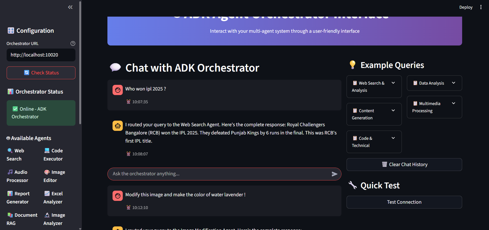

# Multi-Agent RAG System

A comprehensive multi-agent system built with A2A (Agent-to-Agent) and ADK (Agent Development Kit) frameworks, featuring 11+ specialized agents for various tasks including RAG, Excel processing, audio processing, image analysis, and more.

## How it works??


## 🏗️ System Architecture

```
MAS (Multi-Agent System)
├── 🤖 Agents (111+ specialized agents)
│   ├── 🗄️ RAG Agent - Document retrieval and question answering
│   ├── 📊 Excel Agent - Spreadsheet processing and analysis
│   ├── 🔊 Audio Agent - Audio processing and transcription
│   ├── 🖼️ Image Analyzer Agent - Computer vision and image analysis
│   ├── 🎨 Image Generation Agent - AI-powered image creation
│   ├── 🔄 Image-to-Image Agent - Image transformation
│   ├── 📝 Report Generator Agent - Automated report creation
│   ├── 🎥 Video Agent - Video processing and analysis
│   ├── 🔍 Web Search Agent - Internet search and data gathering
│   └── 📄 Code Executor Agent - Code execution and debugging
├── 🎭 Translation Orchestrator Agent - Central coordination hub
└── 🌐 Streamlit Web Interface - User-friendly dashboard
```

## 📁 Project Structure

```
multiagent-rag-system/
├── Agents/
│   ├── __pycache__/
│   ├── audio_agent/
│   ├── code_executor_agent/
│   ├── Excel_agent/
│   ├── Image_analyzer_agent/
│   ├── Image_generation_agent/
│   ├── img_to_img_agent/
│   ├── Rag_agent/
│   ├── report_gen_agent/
│   ├── Video_agent/
│   ├── web_search_agent/
│   └── __init__.py
├── translation_orchestrator_agent/
│   ├── pycache/
│   └── __main__.py
├── myenv/
├── test_files/
├── a2a_translation_tools.py
├── adk_agent_executor.py
├── adk_agent.py
├── cli_client.py
├── demo.py
├── dynamic_agent_discovery.py
├── __init__.py
├── __main__.py
├── app.py                    # Streamlit application
├── requirements.txt
├── .env                      # Environment variables
├── .gitignore
├── Dockerfile               # Docker configuration
└── README.md
```

## 🚀 Quick Start

### Prerequisites

- Python 3.13.3+
- Docker (optional)
- Virtual environment (recommended)

### Installation

1. **Clone the repository**
   ```bash
   git clone <repository-url>
   cd multiagent-rag-system
   ```

2. **Create and activate virtual environment**
   ```bash
   python -m venv myenv
   source myenv/bin/activate  # On Windows: myenv\Scripts\activate
   ```

3. **Install dependencies**
   ```bash
   pip install -r requirements.txt
   ```

4. **Configure environment variables**
   ```bash
   cp .env.example .env
   # Edit .env with your API keys and configurations
   ```

## 🏃‍♂️ Running the System

### Method 1: Manual Agent Startup

1. **Start Individual Agents**
   
   Each agent runs independently and can be started using:
   ```bash
   # Audio processing agent
   python -m Agents.audio_agent.__main__
   
   # Excel processing agent
   python -m Agents.Excel_agent.__main__
   
   # RAG agent for document processing
   python -m Agents.Rag_agent.__main__
   
   # Image analysis agent
   python -m Agents.Image_analyzer_agent.__main__
   
   # Image generation agent
   python -m Agents.Image_generation_agent.__main__
   
   # Image-to-image transformation agent
   python -m Agents.img_to_img_agent.__main__
   
   # Report generation agent
   python -m Agents.report_gen_agent.__main__
   
   # Video processing agent
   python -m Agents.Video_agent.__main__
   
   # Web search agent
   python -m Agents.web_search_agent.__main__
   
   # Code executor agent
   python -m Agents.code_executor_agent.__main__
   ```

2. **Start the Orchestrator**
   ```bash
   python -m translation_orchestrator_agent.__main__
   ```

3. **Launch the Streamlit Interface**
   ```bash
   streamlit run app.py
   ```


   ## STREAMLIT APP

   

### Method 2: Docker Deployment

1. **Build the Docker image**
   ```bash
   docker build -t multiagent-rag-system .
   ```

2. **Run with Docker Compose** (if available)
   ```bash
   docker-compose up -d
   ```

3. **Or run individual containers**
   ```bash
   docker run -p 8501:8501 multiagent-rag-system
   ```

## 🎯 Agent Capabilities

### 🗄️ RAG Agent
- Document ingestion and indexing
- Semantic search and retrieval
- Question answering over documents
- Context-aware responses

### 📊 Excel Agent
- Spreadsheet analysis and manipulation
- Data visualization
- Formula calculation
- Report generation from Excel data

### 🔊 Audio Agent
- Audio transcription
- Speech-to-text conversion
- Audio format conversion
- Audio analysis and processing

### 🖼️ Image Processing Agents
- **Image Analyzer**: Object detection, OCR, image classification
- **Image Generator**: AI-powered image creation from text
- **Image-to-Image**: Style transfer, image transformation

### 🎥 Video Agent
- Video analysis and processing
- Frame extraction
- Video summarization
- Content detection

### 🔍 Web Search Agent
- Real-time web searching
- Content scraping
- Information aggregation
- Source verification

### 📝 Report Generator Agent
- Automated report creation
- Multi-format output (PDF, DOCX, HTML)
- Template-based generation
- Data visualization integration

## 🌐 Streamlit Interface Features

- **Multi-Agent Dashboard**: Monitor all agents status
- **Interactive Chat**: Communicate with the orchestrator
- **File Upload**: Process documents, images, audio, video
- **Real-time Results**: View agent responses in real-time
- **Export Options**: Download results in various formats

## 🔧 Configuration

### Environment Variables (.env)
```env
# API Keys
OPENAI_API_KEY=your_openai_key
ANTHROPIC_API_KEY=your_anthropic_key
GOOGLE_API_KEY=your_google_key

# Agent Configuration
ORCHESTRATOR_PORT=10020
MAX_AGENTS=111
AGENT_TIMEOUT=300

# Database
DATABASE_URL=your_database_url

# Logging
LOG_LEVEL=INFO
LOG_FILE=agents.log
```

### Agent Communication
- Agents communicate via HTTP/REST APIs
- Message queuing for asynchronous processing
- Event-driven architecture
- Load balancing across agent instances

## 📊 Monitoring & Logging

- Real-time agent status monitoring
- Comprehensive logging system
- Performance metrics tracking
- Error handling and recovery

## 🐳 Docker Configuration

The system is fully containerized with:
- Multi-stage Docker builds
- Optimized layer caching
- Health checks for all services
- Volume mounting for persistent data

## 📈 Scaling & Performance

- Horizontal scaling support
- Agent load balancing
- Caching mechanisms
- Resource optimization

## 🛠️ Development

### Adding New Agents

1. Create agent directory in `Agents/`
2. Implement agent logic following the ADK pattern
3. Add `__main__.py` for standalone execution
4. Register agent with orchestrator
5. Update documentation

### Testing

```bash
# Run unit tests
python -m pytest tests/

# Test individual agents
python -m Agents.your_agent.__main__ --test

# Integration testing
python test_integration.py
```

## 🤝 Contributing

1. Fork the repository
2. Create a feature branch
3. Make your changes
4. Add tests
5. Submit a pull request

## 📝 License

This project is licensed under the MIT License - see the LICENSE file for details.

## 🆘 Support & Troubleshooting

### Common Issues

1. **Agent Connection Issues**
   - Check if all agents are running
   - Verify port configurations
   - Review firewall settings

2. **Performance Issues**
   - Monitor resource usage
   - Scale agents horizontally
   - Optimize queries and processing

3. **API Rate Limits**
   - Implement proper rate limiting
   - Use API key rotation
   - Cache frequent requests

### Getting Help

- Create an issue on GitHub
- Check the documentation
- Join our Discord community

## 🎯 Roadmap

- [ ] Add more specialized agents
- [ ] Implement agent auto-scaling
- [ ] Enhanced monitoring dashboard
- [ ] Multi-language support
- [ ] Cloud deployment templates
- [ ] Advanced security features

---

**Built with ❤️ using A2A and ADK frameworks**